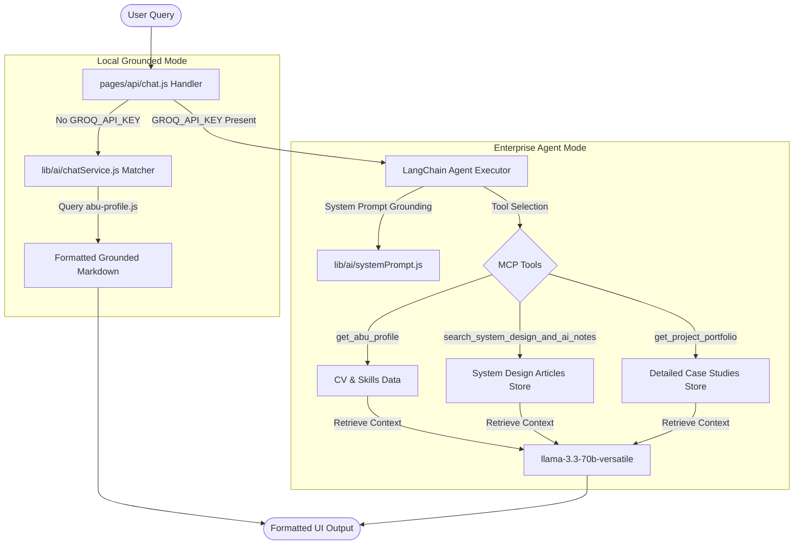

# 🚀 Abu Bokor Siddik (Swann) — Senior Full Stack Architect & AI Engineering Suite


Welcome to **SwannStack**, the enterprise-ready engineering portfolio and semantic knowledge system of **Abu Bokor Siddik** (known professionally as **Swann**). This platform demonstrates production-level full-stack software development, advanced cloud-native distributed microservices, event-driven messaging, and state-of-the-art AI retrieval workflows.

---

## 📖 Executive Profile

*   **Role**: Senior Full Stack Architect & AI Engineer
*   **Core Systems**: Python (FastAPI, Django), Java (Spring Boot), Node.js (NestJS), React, Next.js, and PHP (Laravel).
*   **Infrastructure**: Kubernetes (AWS EKS), Docker, Terraform (IaC), Apache Kafka, and RabbitMQ.
*   **AI Specialty**: RAG Systems, Model Context Protocol (MCP), Multi-Agent Tool Callers, Vector Indexes, and LLMOps.
*   **Academics**: B.Sc in Information & Communication Engineering (BAUET).

---

## 🤖 Chatbot Architecture: "Ask Abu AI"

The portfolio hosts a dynamic, production-grade conversational RAG agent, **Ask Abu AI**. 



### Key Chatbot Engineering Feats:
1.  **Dual Operational Modes**:
    *   **Enterprise Agent Mode**: Utilizes LangChain's `createOpenAIFunctionsAgent` to orchestrate Groq `llama-3.3-70b-versatile` under a super-low temperature (0.2) to enforce factual, grounded retrieval answers from three specialized semantic tools.
    *   **Local Grounded Mode**: If no `GROQ_API_KEY` is provided, a local heuristic matcher parses developer intents to query Abu's profile structures, delivering rich, fast, offline markdown answers.
2.  **Safety Guardrails**: Implements strict `systemPrompt.js` grounding instructions. If a question is asked outside the scope of Abu's CV documents, the chatbot responds with a unified safety fallback: *"I don't have that information in Abu's profile."*, ensuring zero hallucinations.
3.  **Event-Driven Trigger Architecture**: Features a decoupled custom window event listener (`open-abu-chat`). This allows any standard or MDX-rendered button (such as the Hero CTA or About sidebar) to programmatically open, slide in, and auto-focus the chatbot's input field without requiring state pollution or heavy React Context wrappers.

---

## 🛠️ Complete Technical Skill Matrix

```text
┌─────────────────────────┬────────────────────────────────────────────────────────┐
│ Category                │ Tech Badges                                            │
├─────────────────────────┼────────────────────────────────────────────────────────┤
│ Core Languages          │ Python, Java, Node.js, TypeScript, JavaScript, PHP    │
│ Backend Frameworks      │ FastAPI, Django, Spring Boot, NestJS, Express, Laravel │
│ Frontend Core           │ React, Next.js, TypeScript, TailwindCSS, Redux Toolkit │
│ AI & Vector Systems     │ AI Agents, RAG, MCP, Vector Databases, pgvector        │
│ Cloud & Orchestration   │ Docker, Kubernetes, AWS EKS, Terraform, ArgoCD         │
│ Event Brokers & DBs     │ Kafka, RabbitMQ, WebSockets, PostgreSQL, Redis, MySQL  │
└─────────────────────────┴────────────────────────────────────────────────────────┘
```

---

## 📂 Repository Blueprint

```text
swann-stack/
├── components/          # Premium UI components (ChatSection, Reveal, Sep)
├── content/             # MDX Document Store
│   ├── blog/            # System Design & AI Engineering Notes
│   │   ├── building-rag-ai-knowledge-base.md
│   │   ├── designing-scalable-saas-architecture-microservices.md
│   │   └── event-driven-architecture-kafka-rabbitmq.md
│   └── projects/        # High-Fidelity Case Studies
│       ├── weticket-platform.md
│       ├── mym-manager.md
│       └── swannstack-ai.md
├── data/                # Grounding profile stores (abu-profile.js)
├── layouts/             # Page structural layouts (Home, Services, Post)
├── lib/                 # Core utilities
│   ├── ai/              # Chatbot system prompting & API service engines
│   └── computed-fields/ # Dynamic computed collection parsers
└── pages/               # Routing directories & API Gateway channels
```

---

## ⚙️ Developer Workspace Setup

Clone the repository and spin up the premium development server locally:

### 1. Prerequisite Installations
*   Ensure Node.js v18+ is installed.

### 2. Install Dependencies
```bash
npm install
```

### 3. Setup Environment Variables
Create a `.env.local` file in the root folder:
```ini
# Chatbot Groq LLM Key (Optional: Falls back to Local Grounded Mode if empty)
GROQ_API_KEY=gsk_your_actual_groq_key_here

# Public site deployment URL (Used for generating sitemaps & metadata)
NEXT_PUBLIC_SITE_URL=http://localhost:3000
```

### 4. Run Development Workspace
```bash
npm run dev
```
Open [http://localhost:3000](http://localhost:3000) to view your premium interactive workspace.

### 5. Build for Production
To bundle, lint, verify TypeScript type safety, and trigger sitemap generators:
```bash
npm run build
```

---

## 🗺️ Engineering Roadmap (Upcoming Updates)

- [ ] **Production Vector DB Transition**: Migrate the keyword-based RAG matching pipelines to a production-grade vector indexer using `pgvector` on PostgreSQL or Pinecone, implementing dynamic cosine-similarity semantic scoring.
- [ ] **Embedding Caching Tier**: Introduce a high-performance Redis embedding cache layer to cache identical user semantic embeddings, drastically reducing LLM inference costs and dropping latency to sub-10ms.
- [ ] **Custom Model Context Protocol (MCP)**: Construct a dedicated custom MCP server exposing Abu's local file nodes, enabling prompt-grounded agent workflows to securely audit swann-stack code schemas on the fly.
- [ ] **Real-Time Web Search Tool**: Equip the Ask Abu AI agent with Google Search tools to pull real-time web trends when discussing live SaaS frameworks.
- [ ] **Dynamic SVG Architecture Visualizer**: Build interactive, zoomable microservice blueprints for projects inside case studies.
- [ ] **Multi-Document Analytics Upload**: Let recruiters drag and drop their custom job descriptions to immediately run a gap analysis match against Abu's skills.

---

## 📞 Business Contacts & Links

*   **Professional Name**: Abu Bokor Siddik (Swann)
*   **Direct Phone / WhatsApp**: [+8801748298069](tel:+8801748298069)
*   **Professional Email**: [a.b.siddik.swann@gmail.com](mailto:a.b.siddik.swann@gmail.com)
*   **LinkedIn Portfolio**: [linkedin.com/in/swannts](https://www.linkedin.com/in/swannts/)
*   **GitHub Repositories**: [github.com/Swannts](https://github.com/Swannts)
