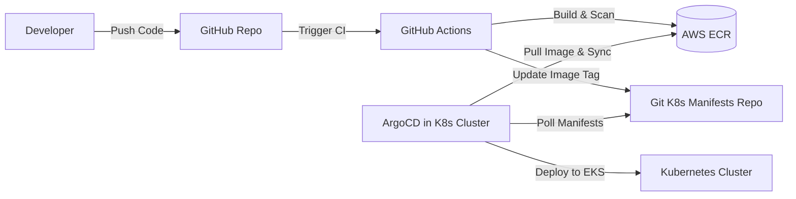

### Introduction

In modern cloud-native engineering, manual deployment is an anti-pattern. A recruiter-ready senior engineer must demonstrate deep knowledge of automating the path from a local `git push` to production. Designing a secure, scalable **Continuous Integration (CI)** and **Continuous Deployment (CD)** pipeline ensures fast release cycles, consistent environments, and bulletproof code quality.

---

### 1. Robust Continuous Integration (CI) Flow

A production-grade CI pipeline enforces quality gates before code is ever merged into the main branch:
*   **Static Analysis (Linting & Formatting)**: Running tools like ESLint, Prettier, or Ruff to enforce unified style guidelines.
*   **Automated Testing**: Executing unit and integration tests under isolated runners, verifying 80%+ code coverage.
*   **Multi-Stage Docker Builds**: Utilizing multi-stage Dockerfiles to build lightweight production images (e.g., building React static files in a Node node, then copying only the assets to a tiny Nginx container). This reduces container size by up to 90% and removes build-time security vulnerabilities.

---

### 2. Secure Container Registry Ingestion

Once tests pass, the container is built and published:
1.  **Unique Tagging**: Never deploy using the `:latest` tag. Tag images with the short Git commit SHA (e.g., `:sha-8a2f9b2`) to ensure absolute traceability and easy rollbacks.
2.  **Vulnerability Scanning**: Scan the container layers using security scanners like **Trivy** or **Anchore** during the build stage. If high or critical vulnerabilities are discovered, abort the build immediately.
3.  **Secure Registry Push**: Authenticate and upload the secure image to private registries like AWS Elastic Container Registry (ECR) or Docker Hub.

---

### 3. GitOps Continuous Deployment (CD)

Rather than having CI runners push commands directly to Kubernetes clusters (which requires giving runners root access keys), modern architectures utilize a pull-based **GitOps** pipeline:

*   **ArgoCD & Flux**: A GitOps agent runs inside the Kubernetes cluster, continuously comparing the desired state documented in a Git manifest repository with the active state in the cluster.
*   **Automated Sync**: When the CI pipeline commits the new image tag to the manifest repository, ArgoCD detects the difference and safely pulls the image, performing a zero-downtime rolling update.

---

### 🏗️ CI/CD Architecture Tradeoffs

| Pattern | Pro | Con | Optimal Context |
| :--- | :--- | :--- | :--- |
| **Push-Based CD** | Simple to configure, no cluster agents required | Requires sharing K8s admin keys with external runners | Small/mid startups |
| **Pull-Based (GitOps) CD** | Extremely secure, automatic drift detection | Higher initial setup and multiple Git repos | Enterprise SaaS, EKS scale |
| **Serverless Deployment** | Instant configuration (e.g. Vercel) | Limited infrastructure control, high vendor lock-in | Frontend / standard Next.js apps |

---

### 💡 Interview Takeaways

*   **Secret Management**: Explain how secrets are injected at runtime using secure key vaults (AWS Secrets Manager, HashiCorp Vault) rather than hardcoding them in Docker images or repository code.
*   **Blue-Green vs Canary**: Explain the difference between deploying a full parallel stage (Blue-Green) versus routing a tiny percentage of traffic to the new version (Canary).
*   **Git Drift**: Discuss how GitOps automatically resolves manual hotfixes in the cluster by immediately overwriting unauthorized edits to match the Git source of truth.

---
