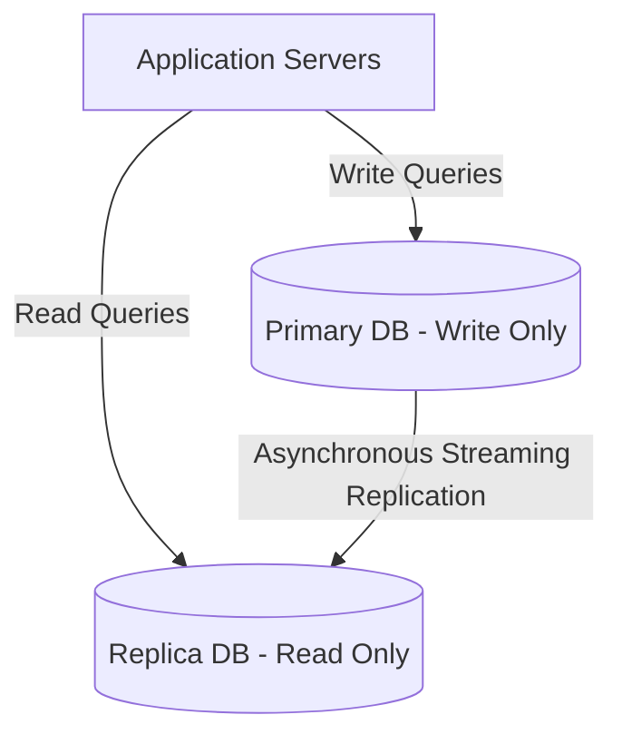

### Introduction

In high-growth SaaS applications, the database is almost always the ultimate bottleneck. As concurrent tenant requests increase, disk I/O, lock contention, and long-running queries will quickly degrade user experience. Designing a high-performance database layer requires deep knowledge of schema isolation, connection pooling, indexing, read/write splits, and proactive caching topologies.

---

### 1. Indexing Strategies & Query Tuning

The easiest way to optimize database reads is through intelligent indexing. For multi-tenant PostgreSQL systems, nearly every query includes a `tenant_id` filter.
*   **Composite Indexes**: Always create composite indexes starting with the partition/tenant key, e.g., `(tenant_id, created_at DESC)` or `(tenant_id, email)`. This allows the query planner to instantly isolate the tenant's subset of rows.
*   **Partial Indexes**: If a table has active flags (e.g. `is_active = true`), partial indexes such as `CREATE INDEX active_leads_idx ON leads (tenant_id) WHERE is_active = true` keep index sizes small and queries lightning fast.
*   **Avoiding Table Scans**: Regularly monitor slow queries using `EXPLAIN ANALYZE` to identify and remove nested loops or sequential scans on large tables.

---

### 2. Scaling Architecture: Read Replicas & Connection Pooling

When a single database node is overwhelmed, we scale by splitting read and write traffic:

*   **Read Replicas**: Route heavy dashboards, reports, and analytical queries to replica nodes, keeping the primary node completely free for quick checkout and record updates.
*   **Connection Pools**: Databases have strict limits on simultaneous connections. Using a pooler like **PgBouncer** in transaction mode prevents the application from exhausting connections, handling thousands of virtual links with a tiny pool of real backend sockets.

---

### 3. Caching Topologies with Redis

The fastest database query is the one that never hits the database. Implementing an intelligent cache topology with **Redis** is vital:
1.  **Cache Aside (Lazy Loading)**: The application checks Redis first. On a cache miss, it fetches from the database, writes the result to Redis, and returns it.
2.  **Write-Through / Write-Back**: Updates write to the database and Redis simultaneously, or write to Redis first and flush to the database asynchronously for maximum write throughput.
3.  **Cache Invalidation**: Always attach Time-To-Live (TTL) limits to cached keys, and invalidate specific cache keys immediately when records are edited to avoid serving stale data.

---

### 🏗️ Database Partitioning Decisions

| Pattern | Pro | Con | Optimal Use Case |
| :--- | :--- | :--- | :--- |
| **Row-Level Partitioning** | Cheap, simple schema migrations | High risk of cross-tenant query leakage | Standard B2B SaaS |
| **Physical Sharding** | Infinite scale, absolute hardware isolation | Very complex cross-shard aggregations | Enterprise-level high-revenue SaaS |
| **Dynamic Table Partitioning** | PostgreSQL native partition by tenant ranges | Management overhead on creating tables | Mid-sized SaaS platforms |

---

### 💡 Interview Takeaways

*   **ACID Guarantees**: Be ready to explain how database transactions maintain **Atomicity, Consistency, Isolation, and Durability** during high-concurrency ticket checkouts.
*   **N+1 Query Problem**: Explain how utilizing eager loading (`JOIN` or `.include()`) in ORMs prevents the application from making N separate database queries for related children.
*   **Connection Starvation**: Discuss how setting up proper connection pooling sizes, statement timeouts, and slow query logging guards against complete site freezes.

---
