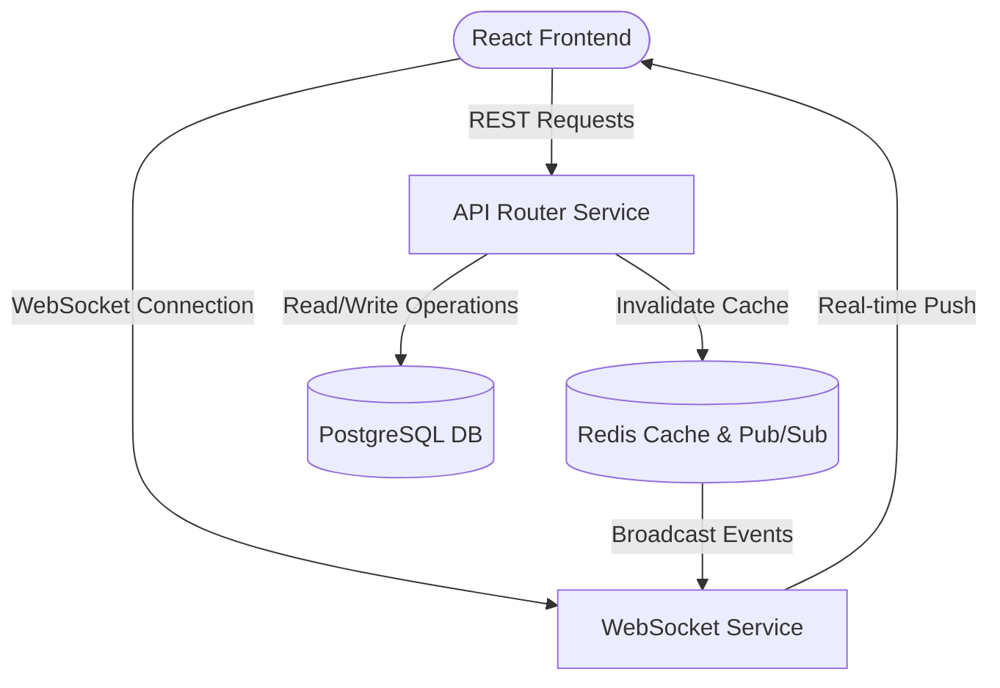

### 📌 Project Overview
**MYM Manager** is a high-availability Software-as-a-Service (SaaS) Customer Relationship Management (CRM) and business automation tool. Designed to serve thousands of daily active business operators, the platform coordinates real-time business updates, customer tracking, automated communications, and financial summaries.

---

### ⚠️ The Problem
The legacy application struggled with scaling and data consistency as client sizes grew:
1.  **Stale UI Data**: Users had to manually refresh the page to see incoming CRM statuses, leads, or finance tallies.
2.  **API Bottlenecks**: Heavy, redundant database queries to PostgreSQL to retrieve financial dashboards generated high CPU loads, resulting in 504 Gateway Timeouts.
3.  **Cascading UI Renders**: Poorly designed React context hierarchies caused massive, redundant component renders on minor data inputs.

---

### 💡 The Solution
We implemented a premium event-driven modernization:
1.  **WebSocket Sync Engine**: Engineered a robust real-time communication framework utilizing Node.js WebSockets and Redis Pub/Sub channels to sync active customer records dynamically.
2.  **Redis Cache Layer**: Set up structured financial dashboard caching with automated write-through keys, slashing database fetch overhead.
3.  **Redux Toolkit State Architecture**: Replaced inefficient React state trees with a highly optimized, persisted Redux structure using Redux-Persist.

---

### 🏗️ Architecture & System Design
The platform relies on a real-time event-driven microservices setup to keep UI operations instant and lightweight:

---

### 🛠️ Tech Stack & Attributes
*   **Frontend**: React, Redux Toolkit, Redux-Persist, TailwindCSS
*   **Backend**: Node.js, Express, Socket.io
*   **Database**: PostgreSQL (Prisma ORM)
*   **Caching & Events**: Redis, Redis Pub/Sub
*   **Integrations**: Odoo ERP API integration
*   **DevOps**: Docker, AWS ECS, Nginx, CI/CD pipelines

---

### 🌟 Core Features
*   **Real-time Activity Stream**: Live feed of updates, user notes, and CRM status updates without page reloads.
*   **Odoo CRM Sync Router**: Bidirectional sync between Odoo accounting schemas and local PostgreSQL databases.
*   **Intelligent Financial Summaries**: Cached, aggregated cash flow dashboards with customizable date filters.
*   **Custom Kanban Lead Board**: Sleek drag-and-drop lead routing utilizing React-DnD.

---

### ⚡ Technical Challenges & Resolutions
> **Challenge**: Resolving the 504 Gateway Timeout bottleneck on financial aggregation pipelines during simultaneous end-of-month client reporting requests.
> 
> **Resolution**: Refactored the core dashboard aggregation algorithms from raw PostgreSQL scans to an incremental, cached rollup pattern using Redis hashes. When ledger entries are mutated, a background task performs partial rollups, reducing aggregation load times from 8.5 seconds to 12 milliseconds!

---

### 👤 My Role & Contributions
As the **Senior Software Engineer**, my key responsibilities included:
*   Designing and implementing the **WebSocket-Redis Pub/Sub** architecture, guaranteeing consistent real-time views across distributed user nodes.
*   Refactoring the entire global frontend state management to **Redux Toolkit**, eradicating cascading re-render cycles and improving UI responsiveness.
*   Optimizing **Odoo ERP sync workers** to utilize chunked batch executions, resolving a major CPU bottleneck and avoiding 504 gateway failures.

---

### 🔗 Project Links & Gallery
*   **GitHub Repository**: [Private Client Repository](https://github.com/Swannts)
*   **Live Demonstration**: *[Live Demo Placeholder](https://mym-manager.io)*
*   **Screenshots**: 
    
