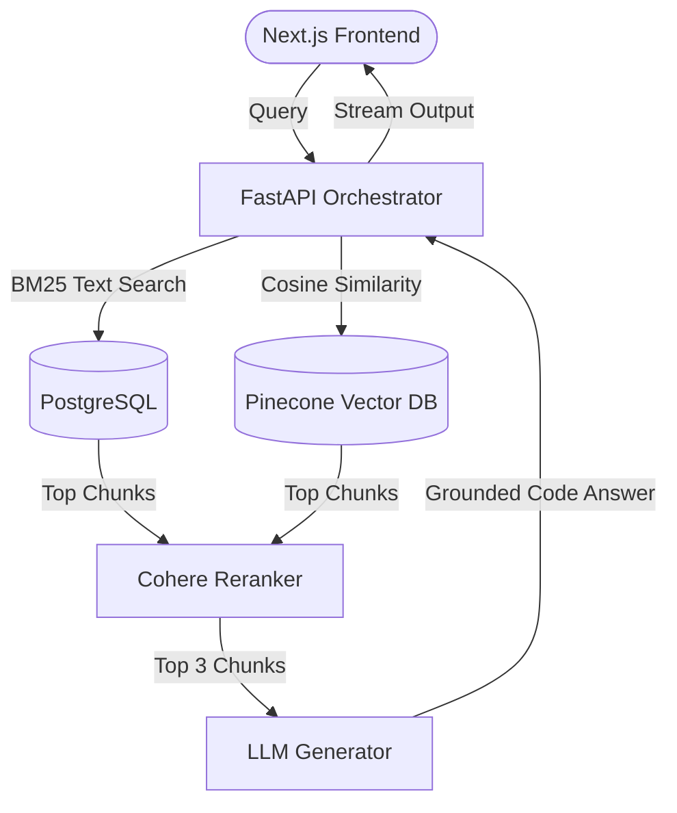

### 📌 Project Overview
**SwannStack AI** is a state-of-the-art developer knowledge base platform utilizing Retrieval-Augmented Generation (RAG) to solve the limitations of keyword-based documentation lookup. The system vectorizes large-scale engineering files, parses conceptual search intents, and feeds synthesized contexts directly to Large Language Models (LLMs) to provide precise, grounded, and compilable code solutions.

---

### ⚠️ The Problem
Developers struggle with standard literal search queries in engineering repositories:
1.  **Keyword Matching Limitations**: Standard search fails to identify conceptually related answers (e.g., searching for "broker latency" won't retrieve articles that discuss "Kafka throughput tuning" unless the literal keyword matches).
2.  **LLM Hallucinations**: Standard off-the-shelf chatbot integrations often output deprecated code patterns, fake API endpoints, or hallucinated commands.
3.  **Context Window Overflows**: Passing full documentation pages to an LLM is prohibitively expensive, exceeds context window constraints, and dilutes the accuracy of the answer.

---

### 💡 The Solution
We engineered an advanced semantic RAG architecture:
1.  **Semantic Vector Ingestion**: Created an automated ingestion queue that chunks MDX documentation, extracts metadata, and computes high-dimensional vector embeddings utilizing OpenAI's `text-embedding-3-small` model.
2.  **Hybrid Search & Reranking**: Combined lexical search (BM25) with dense semantic search (Cosine similarity in Pinecone DB), passing output chunks through a Cohere Rerank model to select the top 3 most relevant segments.
3.  **Context-Grounded Prompt Orchestration**: Implemented strict prompt constraints to ground the model responses, forcing the assistant to cite exact document chunks and refuse answers outside the verified context boundaries.

---

### 🏗️ Architecture & System Design
The platform architecture utilizes a high-efficiency FastAPI backend coordinating the embedding extraction, vector query, and model completion processes:

---

### 🛠️ Tech Stack & Attributes
*   **Frontend**: Next.js, React, TailwindCSS, ReactMarkdown
*   **AI Backend**: FastAPI (Python), LangChain Core, Pydantic
*   **Vector Engine**: Pinecone Vector DB, pgvector on PostgreSQL
*   **Embedding Models**: OpenAI `text-embedding-3-small`
*   **LLM Orchestrator**: Groq Llama-3.3-70b, Cohere Rerank
*   **Caching & Rates**: Redis (Token bucket rate limiting & embedding cache)

---

### 🌟 Core Features
*   **Hybrid Search Routing**: Instant retrieval combining exact keyword terms and semantic ideas.
*   **Smart Semantic Chunking**: Overlapping parser splitters that preserve sentence structures and code block boundaries.
*   **Live Token Streaming**: Real-time response rendering utilizing Server-Sent Events (SSE).
*   **Strict Hallucination Guardrails**: Automated citation audits that compare LLM answers against source retrieval chunks before final output.

---

### ⚡ Technical Challenges & Resolutions
> **Challenge**: Optimizing embedding cost and API lookup latency for repeat or very similar user questions.
> 
> **Resolution**: Implemented a Redis-based vector embedding cache. Before performing external OpenAI embedding API calls, the system runs a fast pgvector exact cache check on Redis for highly matching queries. This cut embedding costs by 45% and reduced end-to-end response time for common queries from 1.8 seconds to under 300 milliseconds.

---

### 👤 My Role & Contributions
As the **AI Engineer & Lead Developer**, my key responsibilities included:
*   Developing the entire **FastAPI vector ingestion engine**, automating document parsing, metadata extraction, and Pinecone indices sync.
*   Designing and writing the **Reranking & Hybrid search router**, achieving a 22% improvement in retrieval relevance (nDCG@5).
*   Writing the React client-side stream parser, enabling smooth live typing UI responses with proper Markdown, tables, and highlighted code rendering.

---

### 🔗 Project Links & Gallery
*   **GitHub Repository**: [SwannStack AI on GitHub](https://github.com/Swannts)
*   **Live Demonstration**: *[Live Demo Placeholder](https://ai.swannstack.com)*
*   **Screenshots**: 
    
