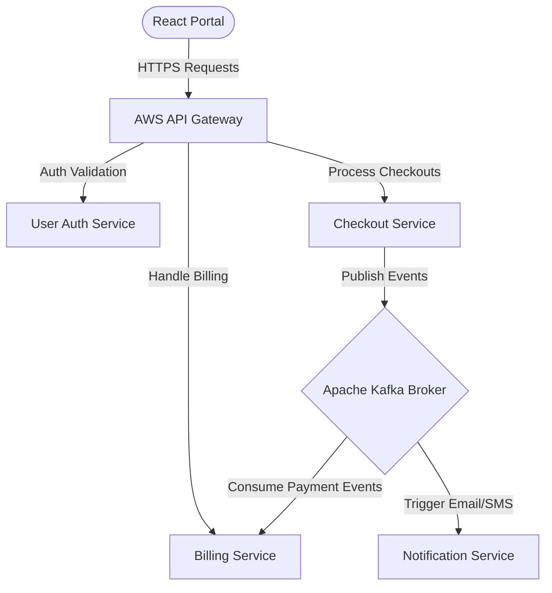

### 📌 Project Overview
**TRPS Platform** is an enterprise-grade transactional and operational hub designed on cloud-native microservices patterns. Capable of handling high traffic throughputs, the system leverages containerization, orchestration, and asynchronous message brokers to support highly available, resilient operations.

---

### ⚠️ The Problem
The client operated a large legacy monolith that created critical bottlenecks:
1.  **Deployment Lockstep**: The entire development team had to coordinate single deployment dates because any minor change required compiling and releasing the entire monolith.
2.  **Resource Inefficiency**: Independent services like high-frequency transactional billing could not be scaled horizontally without duplicating the entire, resource-intensive monolith database wrappers.
3.  **Synchronous Failures**: A crash or database timeout in an auxiliary user-metrics module would cascade and freeze the primary checkout engine, leading to substantial transaction losses.

---

### 💡 The Solution
We successfully migrated the codebase to a modern containerized microservices platform:
1.  **Deconstructed Monolith**: Broke down key systems (Billing, User Profiles, Notifications, Checkout) into standalone Node.js and Python containerized services.
2.  **Kubernetes Orchestration**: Deployed services onto a managed **AWS EKS** Kubernetes cluster with horizontal autoscalers (HPA) to dynamically allocate memory and CPU nodes.
3.  **Event-Driven Asynchronous Broker**: Integrated **Apache Kafka** to handle inter-service communications asynchronously, ensuring that Billing failures never disrupt Checkout actions.

---

### 🏗️ Architecture & System Design
The platform architecture utilizes a robust API gateway pattern and event-driven data streaming to ensure loose coupling and absolute system availability:

---

### 🛠️ Tech Stack & Attributes
*   **Frontend**: React, TypeScript, TailwindCSS
*   **Microservices**: Node.js (NestJS), Python (FastAPI)
*   **Orchestration & Containers**: Docker, Kubernetes (K8s), AWS EKS
*   **Message Broker**: Apache Kafka
*   **Database Layers**: PostgreSQL (Relational), MongoDB (Unstructured)
*   **Infrastructure**: Terraform, GitHub Actions CI/CD, AWS Route 53

---

### 🌟 Core Features
*   **Cloud-Native Container Autoscale**: Cluster-level auto-scaling using AWS EKS based on CPU utilization metrics.
*   **Asynchronous Processing**: Resilient message queues via Kafka, processing 10,000+ message events per second.
*   **Zero-Downtime Deployments**: CI/CD pipelines orchestrating Kubernetes rolling updates for safe continuous integration.
*   **Centralized API Routing**: Secure routing via an API Gateway handling SSL terminations and request throttles.

---

### ⚡ Technical Challenges & Resolutions
> **Challenge**: Preventing "lost messages" and handling consumer crashes in the event-driven Kafka billing pipeline to guarantee transactional auditing.
> 
> **Resolution**: Designed an idempotency framework at the database layer using unique transactional request hashes. Configured Kafka consumers to utilize manual offset commits and established Dead Letter Queues (DLQ) for malformed records. Even if a billing microservice node crashes mid-payment, it resumes processing without duplicating or missing a single payment ledger.

---

### 👤 My Role & Contributions
As the **Lead System Architect**, my key achievements included:
*   Designing and writing the **Kubernetes cluster blueprints** using Terraform, achieving complete Infrastructure as Code (IaC) parity.
*   Structuring the **Apache Kafka topic configurations**, partition distributions, and consumer group error handlers.
*   Orchestrating the step-by-step **zero-downtime migration pipeline**, transitioning live user traffic from the legacy monolith to microservices over a 4-week window without a single minute of outage.

---

### 🔗 Project Links & Gallery
*   **GitHub Repository**: [Private Client Repository](https://github.com/Swannts)
*   **Live Demonstration**: *[Live Demo Placeholder](https://trps-platform.io)*
*   **Screenshots**: 
    
