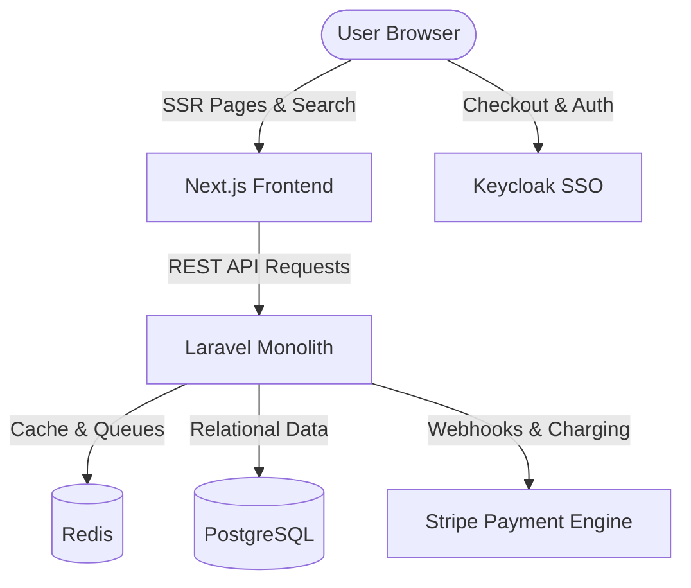

### 📌 Project Overview
**WeTicket** is an enterprise-grade ticketing and event transaction engine built to handle high-concurrency purchase spikes (ticket "drops") with absolute data integrity and zero double-bookings. The platform integrates complex third-party identity providers and global payment gateways, serving as a robust transactional backend for high-profile public events.

---

### ⚠️ The Problem
Ticketing platforms suffer from massive performance degradation and race conditions when high-demand events release tickets. Major problems included:
1.  **Race Conditions**: Multiple users purchasing the same seat concurrently, leading to double-booked seats.
2.  **Authentication Bottlenecks**: Standard database authentication failing under heavy login spikes when sales began.
3.  **Payment Synchronization**: Ensuring payment failures immediately freed locked seats, while successful payments immediately committed tickets without transaction losses.

---

### 💡 The Solution
We implemented a robust architecture using decoupled systems:
1.  **Atomic Transaction Locks**: Built a high-performance Redis queue and database transactional lock that prevents seat selection overlapping.
2.  **Decoupled Auth via Keycloak SSO**: Offloaded authentication and session management to an optimized Keycloak cluster, freeing up application processing threads.
3.  **Webhook-Driven Payment Reconciliation**: Integrated Stripe with a multi-step callback system to manage payment intent lifetimes, automatically unlocking tickets if Stripe checkout failed or timed out.

---

### 🏗️ Architecture & System Design
The platform is designed as a decoupled modern stack to separate static content rendering from transactional operations:

---

### 🛠️ Tech Stack & Attributes
*   **Frontend**: Next.js, React, TailwindCSS, HTML5/CSS3
*   **Backend**: Laravel (PHP), Redis Queue Engine
*   **Identity**: Keycloak (OIDC / OAuth2 SSO)
*   **Payments**: Stripe API, Custom Webhook Handlers
*   **Database**: PostgreSQL
*   **Infrastructure**: Nginx, Docker, AWS S3

---

### 🌟 Core Features
*   **Real-time Ticket Locks**: 10-minute hold window during checkout with Redis cache expiration keys.
*   **Multi-tenant Organization Portals**: Allowed event managers to design, customize, and price event venues.
*   **Interactive Venue Maps**: Interactive SVG seat layouts with instant availability updates.
*   **Enterprise Identity (SSO)**: Keycloak-based login ensuring secure session tokens across corporate subdomains.

---

### ⚡ Technical Challenges & Resolutions
> **Challenge**: Eliminating race conditions during peak seat selections when 10,000+ users choose from 500 available seats.
> 
> **Resolution**: Designed a pessimistic locking mechanism at the database transaction layer using PostgreSQL's `SELECT ... FOR UPDATE`, coupled with an ephemeral Redis lease key for fast fail-early checks. This reduced database query load by 70% and completely resolved seat collisions.

---

### 👤 My Role & Contributions
As the **Full Stack Developer**, my key responsibilities included:
*   Architecting the **Stripe Payment API** custom integration, managing pre-authorizations, payouts, and automated invoice delivery.
*   Implementing **Keycloak Identity Orchestration**, configuring user federation, custom scopes, and secure Next.js middleware token validation.
*   Designing and optimizing the Next.js **Server-Side Rendered (SSR)** event pages, which improved our Google Lighthouse SEO score to 98% and LCP to under 1.2s.

---

### 🔗 Project Links & Gallery
*   **GitHub Repository**: [Private Client Repository](https://github.com/Swannts)
*   **Live Demonstration**: *[Live Demo Placeholder](https://weticket.co)*
*   **Screenshots**: 
    
